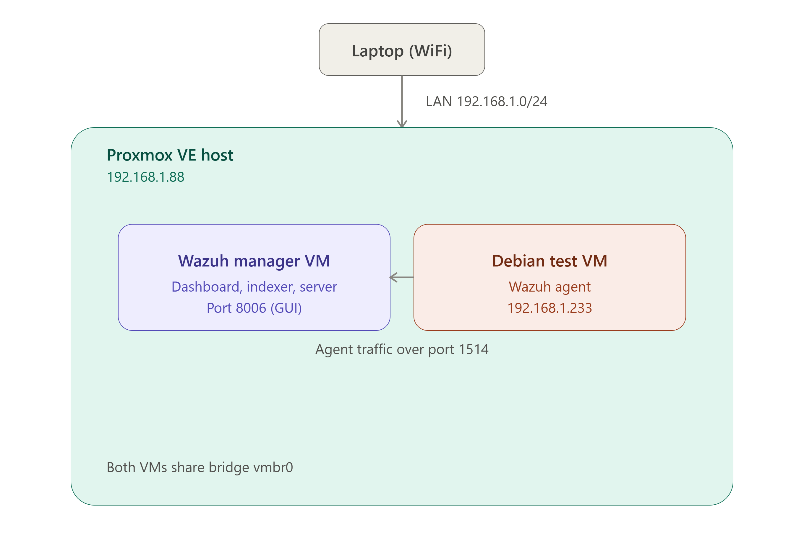
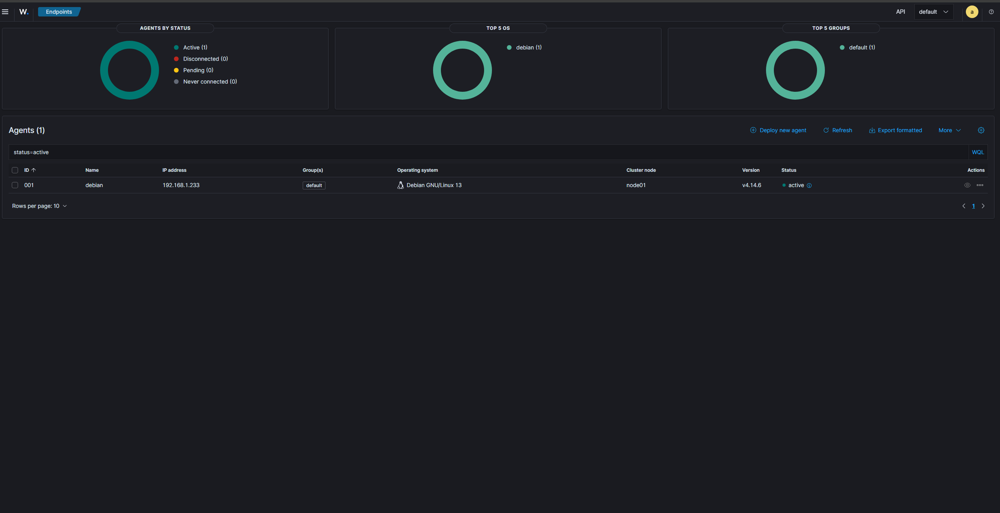
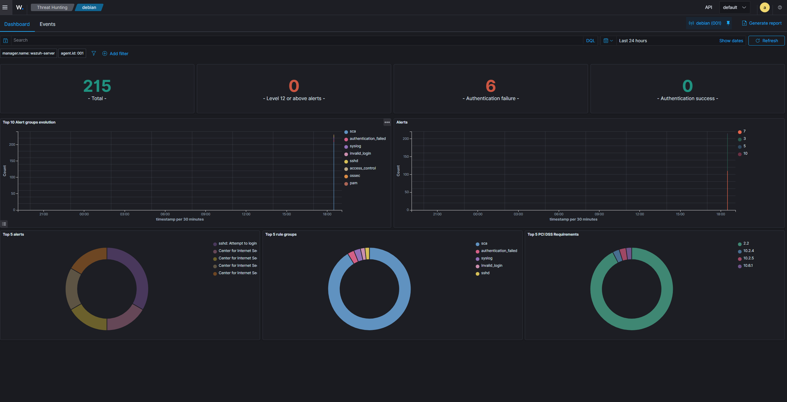

# Home Lab SIEM Deployment: Wazuh on Proxmox VE

## Objective

Deploy a self-hosted Security Information and Event Management (SIEM) platform in a virtualized home lab environment, onboard a monitored endpoint, and validate end-to-end detection capability (agent enrollment → log collection → alerting) as a foundation for future offensive/defensive security projects (e.g., an Active Directory attack lab).

## Architecture

- **Hypervisor:** Proxmox VE 7.0.2, single-node
- **Network:** Bridged (`vmbr0`), static IP `192.168.1.88/24`, gateway `192.168.1.1`
- **Wazuh Manager VM:** hosts the Wazuh server, indexer, and dashboard
- **Monitored Endpoint VM:** Debian 12 (minimal install), static-capable via DHCP, IP `192.168.1.233`
- **Agent-to-manager communication:** TCP port 1514




## What Was Built

1. Repaired a broken Proxmox VE network configuration (see Incident Log below) to restore web GUI access.
2. Deployed a Wazuh manager as a dedicated VM.
3. Provisioned a minimal Debian 12 VM to act as a monitored endpoint.
4. Installed and enrolled the Wazuh agent against the manager.
5. Validated the detection pipeline with a live test: repeated failed SSH login attempts against the monitored endpoint, confirmed as an alert in the Wazuh dashboard's Security Events view.

## Result

The monitored Debian endpoint reports as **Active** in the Wazuh dashboard, and failed authentication attempts against it generate visible alerts — confirming the full pipeline (agent → manager → indexer → dashboard) functions correctly.





## Incident Log: Troubleshooting Notes

Real-world lab work rarely goes cleanly on the first pass. Documenting the failures below because diagnosing them was as valuable as the deployment itself.

### 1. Proxmox web GUI unreachable after fresh install

**Symptom:** Could not reach `https://<IP>:8006` from another machine on the LAN.

**Diagnosis process:**
- Confirmed via `ip a` that the bridge interface (`vmbr0`) had no IPv4 address assigned — only an IPv6 link-local address.
- Inspected `/etc/network/interfaces` and found the static IP was misconfigured: `192.168.1.288/24` — **288 is not a valid IPv4 octet** (max is 255), so the interface silently failed to bind an address.
- Corrected the address to `192.168.1.88/24`, restarted networking, confirmed the interface picked up the new address.

**Follow-on issue:** GUI was still unreachable (browser timeout, not "connection refused") even after the IP fix. Traced this to the Proxmox cluster filesystem (`pmxcfs`) stuck in a restart loop:
```
pmxcfs[...]: [main] crit: Unable to resolve node name 'pve' to a non-loopback IP address
```
Found the same invalid `.288` typo duplicated in `/etc/hosts`, which `pmxcfs` depends on to resolve its own hostname to a real interface IP. Corrected the entry, restarted `pve-cluster`, confirmed it reached `active (running)` state (rather than looping in `activating`), then restarted `pveproxy` to restore GUI access.

**Root cause:** A single invalid IP address typo, duplicated across two separate config files, cascaded into breaking three dependent services (networking → cluster filesystem → web proxy).

### 2. Wazuh agent installation: silent failures from a missing dependency

**Symptom:** `apt-get update` failed with GPG/signature errors after adding the Wazuh repository; `wazuh-agent` package was never visible via `apt-cache policy`.

**Diagnosis process:**
- First error: `Permission denied (os error 13)` reading the GPG keyring file — traced to an earlier failed command chain where a typo (`pnupg` instead of `gnupg`) broke a chained `&&` command, causing the `chmod 644` step to never execute.
- After fixing permissions, a new error surfaced: `Missing key ... which is needed to verify signature` — the keyring file existed but was empty.
- Root cause: `curl` was not installed on the minimal Debian image. Every command piping through `curl` had been failing silently (`-bash: curl: command not found`) without halting the script, leaving downstream steps operating on empty/missing files.
- Installed `curl`, re-ran the key download and import cleanly, verified the key file contained valid PGP data before importing, and `apt-get update` succeeded.

**Root cause:** A missing base utility (`curl`) on a minimal OS install caused cascading, non-obvious failures several steps downstream.

### 3. Wazuh agent enrolled but connecting to the wrong manager

**Symptom:** Agent installed and service reported `active (running)`, but did not appear in the Wazuh dashboard.

**Diagnosis process:**
- Checked `/var/ossec/logs/ossec.log` and `/var/ossec/etc/ossec.conf` and found the agent was not configured with the intended manager IP — the `WAZUH_MANAGER` environment variable passed at install time had not persisted into the config.
- Fixed by directly editing the `<server><address>` value in `ossec.conf` and restarting the agent service.

**Root cause:** Environment variable did not propagate through the install command as expected; resolved via direct configuration file edit rather than reinstalling.

## Skills Demonstrated

- Linux/Debian system administration (networking, systemd, package management)
- Proxmox VE hypervisor administration and VM provisioning
- SIEM deployment and agent-based log collection (Wazuh)
- Root-cause troubleshooting across a multi-layer stack (network config → cluster services → application layer)
- Reading and interpreting system logs (`journalctl`, `ossec.log`) to isolate failures
- Documentation of technical work for a non-technical audience

## Next Steps

- Deploy a Windows Server VM as a domain controller for a small Active Directory environment.
- Onboard Windows-specific log sources (Sysmon, Windows Event Logs) to Wazuh.
- Simulate common AD attack techniques (Kerberoasting, AS-REP roasting) and build/tune custom Wazuh detection rules for each.
- Document detection coverage and gaps as a purple-team style write-up.
