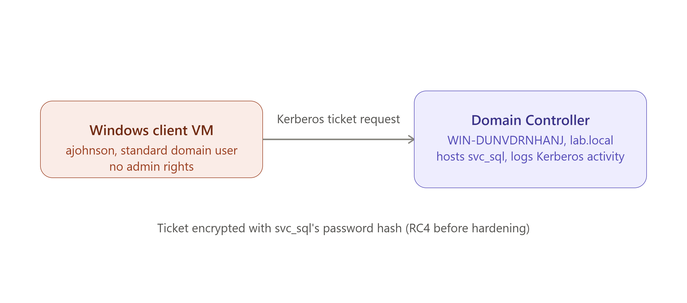

# Active Directory Attack Lab: Kerberoasting a Vulnerable Service Account

*Part 1 of 2 — see [Part 2: GPO Hardening & Remediation](./GPO-hardening-README.md) for the fix and verification that closes this out.*

## Objective

Build a small Active Directory environment on the existing Proxmox home lab, populate it with realistic accounts including a deliberately vulnerable service account, and execute a real Kerberoasting attack (MITRE ATT&CK T1558.003) against it — confirming the attack in the Domain Controller's own Security event log.

## Architecture

- **Hypervisor:** Proxmox VE (same host as the [Wazuh SIEM project](./README.md))
- **Domain Controller VM:** Windows Server 2022, hostname `WIN-DUNVDRNHANJ`, domain `lab.local`
- **Client VM:** Windows 10 Pro, domain-joined to `lab.local`
- **Accounts created:** two standard "employee" accounts (`ajohnson`, `bsmith`) for realistic directory noise, plus one deliberately vulnerable service account (`svc_sql`)

```
[ Windows Client VM ]  --domain auth-->  [ Domain Controller: WIN-DUNVDRNHANJ ]
   (ajohnson, standard                     (lab.local, hosts svc_sql,
    domain user, no admin rights)            logs all Kerberos activity)
```



## Building the Vulnerable Target

The core of this lab is a single account, `svc_sql`, configured the way real-world service accounts commonly (and mistakenly) are:

```powershell
$svcPw = ConvertTo-SecureString "Summer2024!" -AsPlainText -Force
New-ADUser -Name "SQL Service Account" -SamAccountName "svc_sql" `
  -UserPrincipalName "svc_sql@lab.local" -Path "OU=ServiceAccounts,DC=lab,DC=local" `
  -AccountPassword $svcPw -Enabled $true -PasswordNeverExpires $true

setspn -A MSSQLSvc/WIN-DUNVDRNHANJ.lab.local:1433 LAB\svc_sql
```

Two properties make this account exploitable:
- **`PasswordNeverExpires`** — mirrors the common real-world habit of never rotating service account passwords, since rotating them risks breaking whatever depends on them.
- **A registered SPN (Service Principal Name)** — this is what makes the account *requestable*. Once an SPN exists, any authenticated domain user can ask the Domain Controller for a Kerberos service ticket to that "service" — no elevated privilege required. That ticket is encrypted using a key derived from the service account's own password, which is the entire basis of the attack: request the ticket like anyone would, then attempt to crack it offline.

## Incident Log: Standing Up the Domain

As with the Wazuh project, the infrastructure work here surfaced several real, non-obvious failures worth documenting — diagnosing them was as much the point of this project as the attack itself.

### 1. Client VM couldn't join the domain — "The request is not supported"

**Symptom:** `Add-Computer -DomainName "lab.local"` failed repeatedly with a generic error: `The request is not supported`, regardless of credentials used.

**Diagnosis process (ruled out in order):**
- **Network adapter type** — checked whether the client was using a VirtIO adapter (a known source of domain-join quirks in Proxmox); confirmed it was already using Intel E1000, ruling this out.
- **DNS resolution** — confirmed via `nslookup lab.local` that the client correctly resolved the DC's IP; not a DNS issue.
- **Clock skew** — Kerberos is sensitive to time differences between client and DC; checked and synced both, but the join still failed, ruling this out as the sole cause.
- **SMB services and network profile** — checked `LanmanWorkstation`/`LanmanServer` (both running), then checked `Get-NetConnectionProfile` and found the network category set to **Public**. Windows restricts several domain-join-dependent operations on a Public profile.
- Corrected it: `Set-NetConnectionProfile -InterfaceAlias "Ethernet" -NetworkCategory Private`

**Root cause, actually:** After fixing the network profile and still hitting the identical error, checked the domain-join diagnostic log directly:
```powershell
Get-Content C:\Windows\debug\NetSetup.log -Tail 60
```
This revealed the true cause: `SKU: Windows 11 Home`. **Windows 11 Home cannot join an Active Directory domain at all** — the feature is locked to Pro/Enterprise/Education editions. Every other fix attempted was reasonable troubleshooting, but none of them could have worked, since this was an edition-level restriction, not a configuration issue.

**Resolution:** Upgraded the installed edition in place using a generic Microsoft public key (`slmgr /ipk`, followed by `DISM /Online /Set-Edition`, and ultimately the GUI-driven `changepk.exe` wizard, which succeeded where the command-line tools didn't cleanly complete the cross-edition upgrade). Client ended up on Windows 10 Pro, which supports domain join identically to Windows 11 Pro for this purpose.

**Lesson:** A vague, generic OS error can have a root cause several layers away from anything configuration-related. Working through each layer systematically (adapter → DNS → time → network profile → OS edition) — rather than guessing — was what eventually surfaced the actual, unfixable-by-configuration cause.


## Executing the Attack

Logged in as `ajohnson` — a standard, non-administrative domain user, simulating an attacker who has compromised a regular employee's machine rather than starting with elevated access:

```powershell
Add-Type -AssemblyName System.IdentityModel
New-Object System.IdentityModel.Tokens.KerberosRequestorSecurityToken -ArgumentList "MSSQLSvc/WIN-DUNVDRNHANJ.lab.local:1433"
```

This single command **is** the attack — no special tooling required, since Kerberoasting abuses a legitimate, by-design Kerberos feature rather than exploiting a bug. The command returned a valid service ticket for `svc_sql`, confirmed by the response object showing `ServicePrincipalName : MSSQLSvc/WIN-DUNVDRNHANJ.lab.local:1433`.

## Confirming the Attack in the Security Log

On the DC:
```powershell
Get-WinEvent -FilterHashtable @{LogName='Security'; Id=4769} -MaxEvents 5 | Format-List TimeCreated, Message
```

This confirmed **Event ID 4769** ("A Kerberos service ticket was requested") logged at the exact time of the attack, with:
```
Ticket Encryption Type: 0x17
```
**`0x17` is RC4** — the weak cipher that makes this ticket practically crackable offline, and the specific fingerprint that separates a legitimate service ticket request from an at-risk one.


## Result

A low-privilege domain user account, with no special tooling, successfully obtained a crackable Kerberos ticket for a service account — demonstrating exactly why service accounts with SPNs and static passwords are a common real-world AD weakness. This is confirmed directly in the DC's own Security event log, not inferred.

## Skills Demonstrated

- Windows Server / Active Directory Domain Services deployment and configuration
- Understanding of Kerberos authentication internals (SPNs, service tickets, encryption types) well enough to both create and exploit the vulnerability intentionally
- Systematic, layer-by-layer troubleshooting of a vague OS-level error down to its actual root cause
- Direct log-based verification of an attack technique, rather than assuming success

## Next Steps

See **[Part 2: GPO Hardening & Remediation](./GPO-hardening-README.md)** — closing this vulnerability via Group Policy and proving the fix by re-running this exact attack against the hardened domain.
