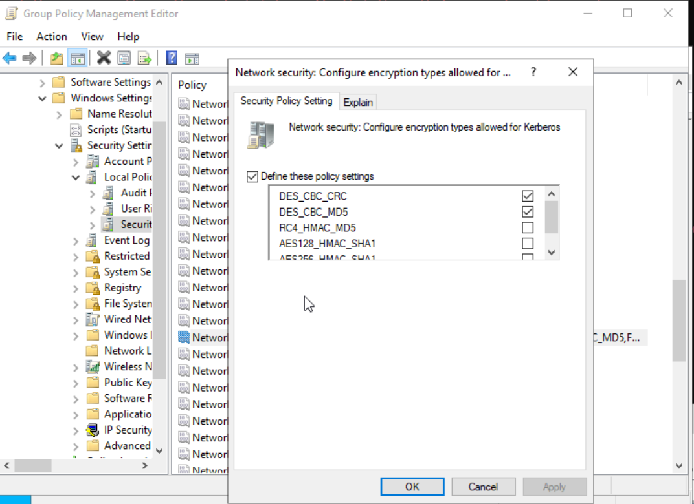
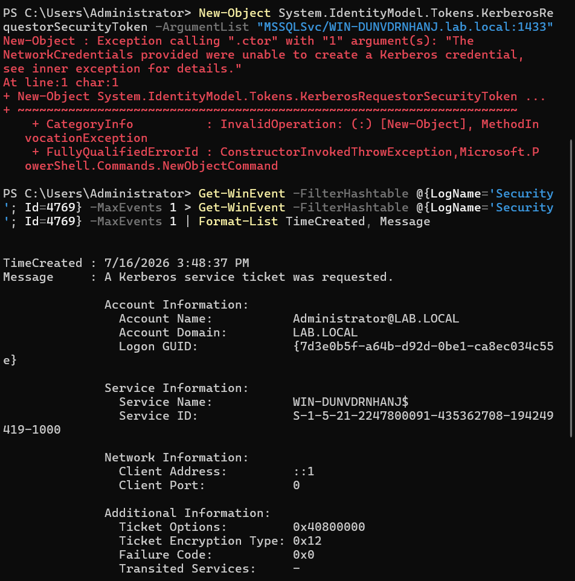

# Active Directory Hardening: Closing the Kerberoasting Vulnerability

## Objective

*Part 2 of 2 — see [Part 1: Active Directory Attack Lab](./AD-attack-lab-README.md) for the full build and attack this remediates.*

Following up on [Part 1](./AD-attack-lab-README.md), this project closes the loop on the Kerberoasting vulnerability demonstrated earlier — implementing a real Group Policy hardening change, then re-running the identical attack to prove the fix works. This is the "remediate" step of a full attack → detect → remediate narrative.

## Background

In the earlier phase of this lab, a service account (`svc_sql`) with an SPN and no password rotation was successfully Kerberoasted from a low-privilege domain user account. The DC issued a Kerberos service ticket encrypted with **RC4 (encryption type `0x17`)** — a weak, legacy cipher that makes offline password cracking of the ticket feasible. RC4 is only used because Windows domains allow it by default for backward compatibility with older systems; most modern environments don't need it and can safely disable it.

## The Fix

**Setting changed:** `Computer Configuration → Policies → Windows Settings → Security Settings → Local Policies → Security Options → "Network security: Configure encryption types allowed for Kerberos"`

**Applied via:** Default Domain Policy (domain-wide enforcement)

**Change made:** Disabled `RC4_HMAC_MD5`, enabled only `AES128_HMAC_SHA1` and `AES256_HMAC_SHA1` (plus "Future encryption types" for forward compatibility).

This forces every Kerberos ticket issued by the domain — not just for the targeted service account — to use strong AES encryption instead of RC4.



## Verification: Before vs. After

**Before hardening**, requesting a service ticket for `svc_sql`'s SPN succeeded and returned a ticket with:
```
Ticket Encryption Type: 0x17  (RC4)
```
This ticket is fully exploitable — an attacker would take it offline and attempt to crack `svc_sql`'s password using tools like Hashcat.

**After hardening**, running the identical attack command:
```powershell
Add-Type -AssemblyName System.IdentityModel
New-Object System.IdentityModel.Tokens.KerberosRequestorSecurityToken -ArgumentList "MSSQLSvc/WIN-DUNVDRNHANJ.lab.local:1433"
```
now fails outright:
```
Exception calling ".ctor" with "1" argument(s): "The NetworkCredentials provided were unable to create a Kerberos credential, see inner exception for details."
```

Separately, a normal (non-attack) Kerberos ticket request on the same domain now shows:
```
Ticket Encryption Type: 0x12  (AES256)
```
Confirming the policy applied domain-wide, not just blocking this one attack attempt — every ticket issued now uses strong encryption by default.



## Why This Works

RC4's weakness in this context isn't in the cipher's general use — it's that RC4-encrypted Kerberos tickets derive their encryption key directly from the target account's password hash (NTLM hash). That means an attacker with the ticket can attempt to crack it completely offline, with no further contact with the domain controller, at whatever speed their hardware allows. AES-encrypted tickets don't have this same direct derivation weakness, making offline cracking impractical even with the ticket in hand.

## Additional Hardening Considered

Beyond the Kerberos encryption policy, the following CIS-aligned settings are natural companions for a more complete hardening baseline (documented here as scope for a follow-up pass):
- **Account lockout policy** — limit failed login attempts to slow brute-force/password-spray attempts
- **Audit policy for Kerberos Service Ticket Operations** — ensure 4769 events are logged (verified already enabled by default on this DC)
- **Service account password rotation policy** — the underlying real-world fix for Kerberoasting risk isn't just encryption type, it's ensuring service account passwords are long, random, and rotated — ideally replaced with **Group Managed Service Accounts (gMSA)**, which rotate passwords automatically and aren't practically crackable regardless of ticket encryption type

## Skills Demonstrated

- Group Policy Management (GPMC) configuration and domain-wide policy enforcement
- Understanding of Kerberos ticket encryption and why specific cipher choices carry security implications
- Attack/remediation verification methodology — proving a fix works by re-running the original attack, not just applying a setting and assuming success
- Translating a specific vulnerability (weak service account + RC4) into both a technical fix (GPO) and a broader hardening strategy (gMSA, audit policy, lockout policy)

